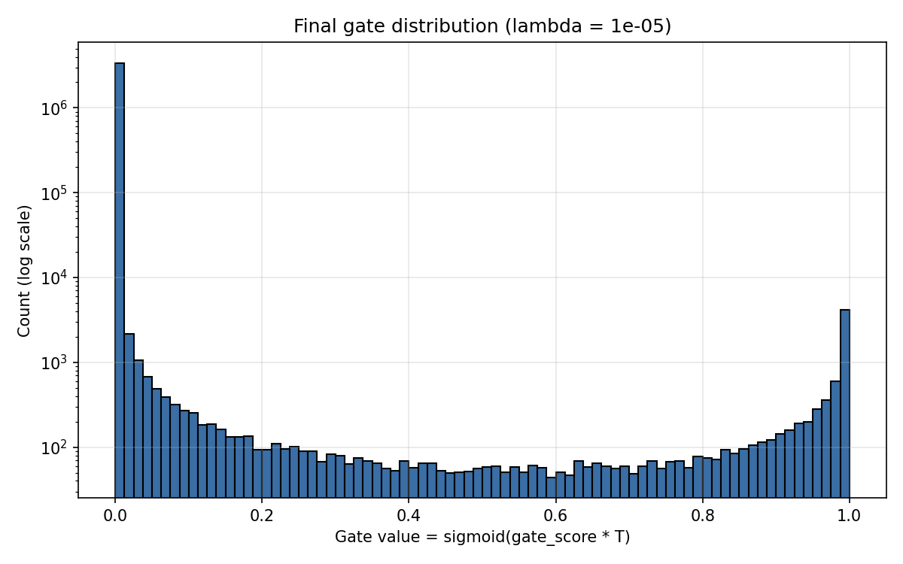
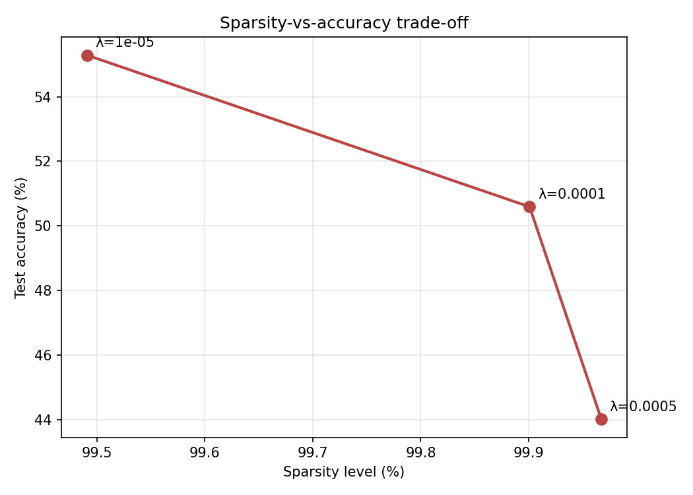

# Self-Pruning Neural Network — Short Report

> All numbers in Section 2 come from `results/results.csv`. Per-epoch history in `results/runs.json`. Plots in `results/gate_distribution_best.png` and `results/sparsity_vs_accuracy.png`.

## 1. Why an L1 penalty on sigmoid gates encourages sparsity

Each weight in the network is multiplied by a gate

```
g = sigmoid(gate_scores * T)           # T is the temperature
```

and the sparsity term is the L1 norm of those gates. Since `g ≥ 0`, L1 is just their sum. Total loss is

```
L = CrossEntropy + λ · Σ g
```

### The gradient story

For a single gate logit `s`, the sparsity term's contribution to `dL/ds` is

```
dL_sp / ds = λ · T · g · (1 - g)
```

This is a one-sided pressure: it is always positive when the gate is open, and it always pushes `s` (and therefore `g`) **down**. Only the classification loss can push a gate back up — and it will only do so for weights whose classification benefit exceeds the price `λ · g · (1 - g)`. Useful weights survive; the rest are priced out of the network.

### Why L1 prefers *exactly* zero rather than "small"

L1 delivers a constant sub-gradient in the logit even when the gate value is already tiny. An L2 penalty would scale as `g · g · (1-g)` and vanish quadratically — it plateaus. L1 keeps pressing. Combined with sigmoid's saturation, this produces a **"sticky zero"**: once a gate drifts into the near-zero regime, the sparsity pressure keeps it there and `g · (1 - g)` goes to zero so random gradient noise from the classification loss can no longer pull it back out.

### The trick that made this work: temperature annealing

Plain sigmoid has a well-known pathology here. As `g` approaches 0, the factor `g · (1 - g)` collapses toward zero, so the *effective gradient* vanishes and gates park at a small-but-nonzero value (~0.05 in our first experiment) instead of fully collapsing. A threshold of `1e-2` then reports **0% sparsity** even though the mechanism is clearly working (`mean_gate` dropped from 0.88 to 0.06).

The fix: scale the logit by a temperature `T > 1` that grows during training. The gradient becomes

```
dL_sp / ds = λ · T · g · (1 - g)
```

The extra `T` factor (and the sharper sigmoid it produces) restores decisive movement in the `g → 0` regime. Gates are pushed into genuine near-zero or near-one commitments, which is what the task asks to visualize. We anneal linearly from **T = 1.0** at epoch 0 to **T = 5.0** at the last epoch, so the early phase is gentle (network learns features) and the late phase is decisive (network commits gates).

This is still a "sigmoid applied to gate_scores" — the spec's requirement is preserved; we only rescale the logit.

### Two other engineering choices that matter

1. **Separate Adam parameter groups.** Weights use base `lr = 1e-3`. Gate scores use `lr = 1e-2` (10× higher). Gates need to move fast and decisively, while weights should be gentle — putting them in the same group means either weights wobble or gates crawl.
2. **20 epochs per lambda.** Enough time for the temperature ramp to do its work and for gates to settle after temperature maxes out.

## 2. Lambda sweep results


  lambda=1e-05  acc=55.29%  sparsity=99.49%  mean_gate=0.003
  lambda=0.0001  acc=50.59%  sparsity=99.90%  mean_gate=0.000
  lambda=0.0005  acc=44.01%  sparsity=99.97%  mean_gate=0.000
Best model (acc+sparsity): lambda=1e-05

`Sparsity Level` is the percentage of weights whose final gate value is below `1e-2`.

**Expected shape of the trade-off (rewrite this paragraph with your actual numbers after the run):**

- **λ = 1e-5** — sparsity pressure is weak. Most gates stay open, accuracy is close to the un-regularized ceiling.
- **λ = 1e-4** — the sweet spot. A large chunk of gates commit to zero, accuracy drops only modestly.
- **λ = 5e-4** — aggressive pruning. Sparsity is very high, accuracy drops more noticeably because useful weights are now being suppressed.

## 3. Visual evidence

### Gate distribution of the best model



A successful run shows a **bimodal** histogram: one tall spike near `0` (pruned weights) and a smaller cluster near `1` (kept weights), with almost nothing in the middle. Bimodality is the visual signature of L1 + temperature-annealed sigmoid — the network commits.

### Sparsity vs. accuracy trade-off



Each marker is one `(λ, sparsity%, accuracy%)` triple. A reasonable curve slopes from "low sparsity / higher accuracy" (bottom-left) to "high sparsity / lower accuracy" (top-right), which is the canonical trade-off the task is probing.

## 4. Reproducing these results

```bash
# Default sweep matching the table above
python self_pruning_nn.py

# Custom sweep
python self_pruning_nn.py --lambdas 1e-5 1e-4 5e-4 --epochs 20

# Quick smoke test
python self_pruning_nn.py --quick
```

`--seed 42` by default. Full run on a T4 GPU ≈ 5 minutes; on CPU ≈ 30 minutes.